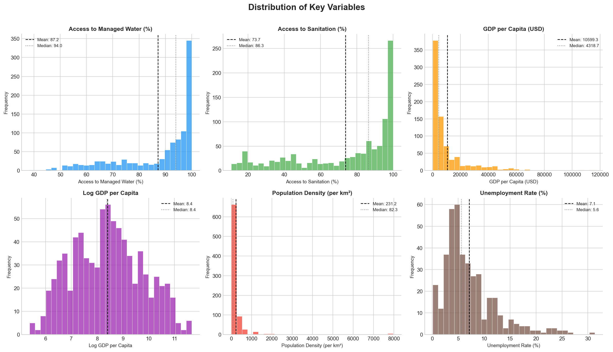
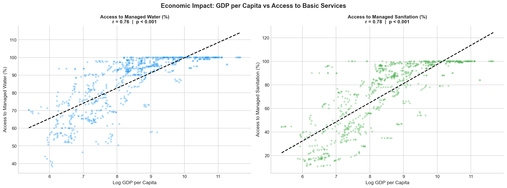
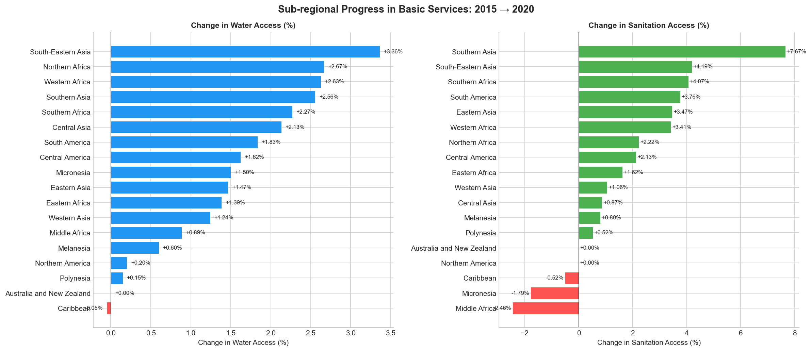
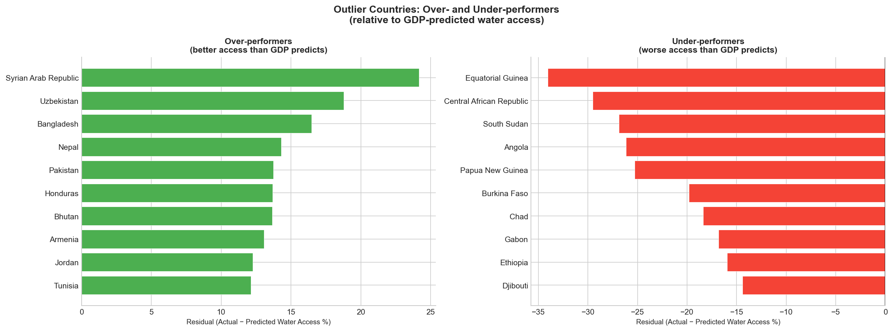

# 🌍 Access to Basic Services: A Global Data Analysis

> *Uncovering what actually drives access to clean water and sanitation across 182 countries — and what the data challenges us to rethink.*


---

## 📌 Project Overview

This project is an end-to-end exploratory data analysis of global access to managed drinking water and sanitation services, framed around the **UN Sustainable Development Goal 6 (SDG 6)** — Clean Water and Sanitation for All.

Using country-level data spanning **2015–2020** across **182 countries**, this analysis moves beyond surface-level statistics to answer five specific questions about the economic, geographic, and demographic forces that determine whether a country's citizens have access to these fundamental services.

---

## 🔍 The Five Analytical Questions

| # | Question | Method |
|---|---|---|
| 1 | Does a higher GDP per capita directly correlate with better water and sanitation access? | Pearson correlation, linear regression |
| 2 | Which sub-regions made the fastest progress between 2015 and 2020? | Time-series group comparison |
| 3 | Is there a significant relationship between unemployment rate and service access? | Pearson + Spearman correlation, hypothesis testing |
| 4 | Do smaller, more densely populated countries have better access rates? | Correlation, segmentation |
| 5 | Which countries are over- or under-performing relative to their GDP? | Residual analysis |

---

## 💡 Key Findings

**1 — GDP explains most, but not all.**
Log GDP per capita accounts for **58.4% of variance** in water access and **61.3%** in sanitation (Pearson r > 0.76, p < 0.001 in both cases). The remaining 39–42% is where governance, policy, and infrastructure history override economics — and that is where this analysis gets interesting.

**2 — Southern Asia achieved the fastest sanitation improvement globally.**
Between 2015 and 2020, Southern Asia improved sanitation access by **+7.67 percentage points** — nearly double the next-fastest sub-region. This reflects the measurable impact of large-scale national sanitation programmes. Meanwhile, Middle Africa's sanitation access *declined* by 2.46pp, a finding that deserves as much attention as the success stories.

**3 — Unemployment has essentially zero relationship with service access.**
This is the counterintuitive null result: r = 0.005 for water access (p = 0.92). Access to water and sanitation is an infrastructure question, not an employment question. Whether citizens are employed does not predict whether they have piped water — what predicts it is whether the government built the pipes.

**4 — Population density is statistically significant but practically weak.**
Density correlates with water access at r = 0.21 (p < 0.0001) — real, but explaining only ~4% of variance. Density alone is not a meaningful predictor of service delivery.

**5 — The outliers tell the most important story.**
- 🔴 **Equatorial Guinea** (GDP/capita: $8,409) has only 58% water access — 34 percentage points below what its wealth predicts. A textbook case of the resource curse.
- 🟢 **Syrian Arab Republic** (GDP/capita: $533) achieves 93.7% water access — 24 points above prediction — reflecting pre-conflict public infrastructure that outlasted economic collapse.

---

## 📊 Visualisations

### Distribution of Key Variables


### GDP per Capita vs Access to Basic Services


### Sub-regional Progress: 2015 → 2020


### Over- and Under-performers


---

## 📁 Repository Structure

```
├── Project_1_access_to_basic_services.ipynb   # Full analysis notebook
├── access_to_basic_services.csv               # Raw dataset
├── fig1_distributions.png
├── fig2_gdp_vs_services.png
├── fig3_regional_progress.png
├── fig4_unemployment_vs_services.png
├── fig5_density_vs_services.png
├── fig6_outliers.png
└── README.md
```

---

## 🗂️ Notebook Structure

The analysis follows a professional, reproducible workflow:

```
1. Import Libraries & Load Data
2. Data Understanding
   └── Shape & structure audit
   └── Missing value analysis & strategy decisions
   └── Descriptive statistics
   └── Sanity checks (duplicates, out-of-range values, negatives)
3. Data Cleaning & Wrangling
   └── Column renaming
   └── Per-analysis null handling (no global row drops)
   └── Feature engineering: GDP_per_capita, Pop_density, Log_GDP_per_capita
4. Exploratory Data Analysis
   └── Distribution analysis
   └── GDP vs water & sanitation (scatter + regression line)
   └── Sub-regional trends 2015–2020
   └── Unemployment link
   └── Population density effect
   └── Outlier identification via residual analysis
5. Statistical Analysis
   └── Pearson & Spearman correlation tests with p-values
   └── R² calculations
   └── Hypothesis testing on unemployment link
6. Key Visualisations
7. Insights & Conclusions
```

---

## 🛠️ Tools & Libraries

| Library | Purpose |
|---|---|
| `pandas` | Data loading, cleaning, wrangling |
| `numpy` | Numerical operations, log transformation |
| `matplotlib` | Base visualisation |
| `seaborn` | Statistical plots |
| `scipy.stats` | Pearson & Spearman correlation, linear regression, p-values |

---

## 📦 Dataset

| Detail | Description |
|---|---|
| **Name** | Access to Basic Services |
| **Source** | UN SDG Database |
| **Records** | 1,048 rows (182 countries × 2015–2020) |
| **Columns** | 10 original + 3 engineered features |
| **Key variables** | Managed water access (%), sanitation access (%), GDP (billions), population (millions), land area (km²), unemployment rate (%) |

### ⚠️ Data Limitations
The unemployment variable (`Pct_unemployment`) contains data for only **38.6% of records** (405/1,048 rows). All unemployment-related findings are presented with this caveat and tested using both parametric and non-parametric methods to confirm consistency. GDP, population, and land area share identical missingness patterns (~22–24%), indicating entire country records are absent — likely small territories not covered by World Bank reporting — rather than random data loss.

---

## 🚀 How to Run

**1. Clone the repository**
```bash
git clone https://github.com/your-username/access-to-basic-services.git
cd access-to-basic-services
```

**2. Install dependencies**
```bash
pip install pandas numpy matplotlib seaborn scipy jupyter
```

**3. Launch the notebook**
```bash
jupyter notebook Project_1_access_to_basic_services.ipynb
```

Run all cells from top to bottom. Charts are saved automatically to the project directory.

---

## 👩‍💻 Author

**Lisa N. Hananiya**
Aspiring Data Scientist | Python | Pandas | SQL | Storytelling with Data

[](https://linkedin.com/in/your-profile)
[](https://github.com/your-username)

---

## 📄 License

This project is open source under the [MIT License](LICENSE).

---

*If this analysis was useful or interesting, please consider leaving a ⭐ on the repository.*
